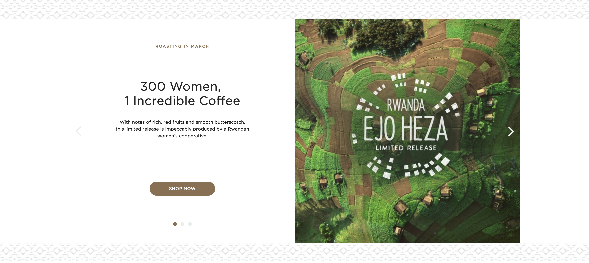
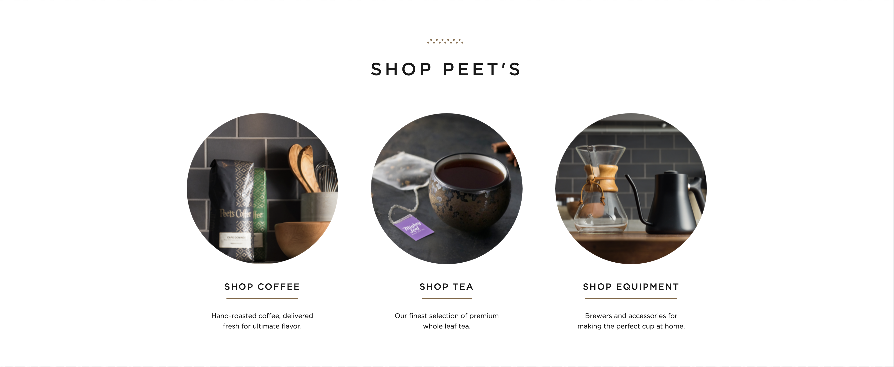
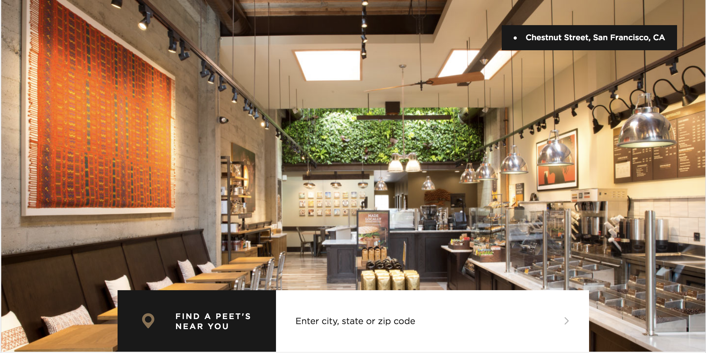
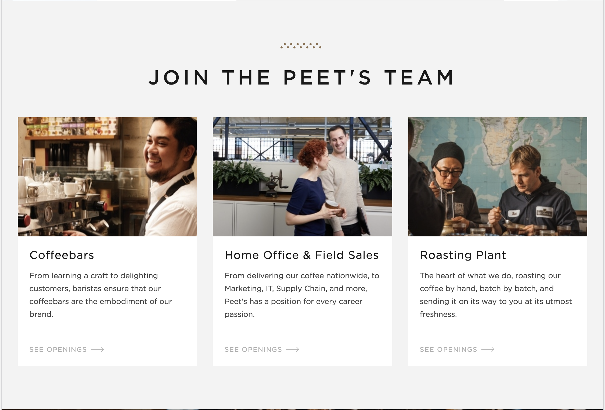
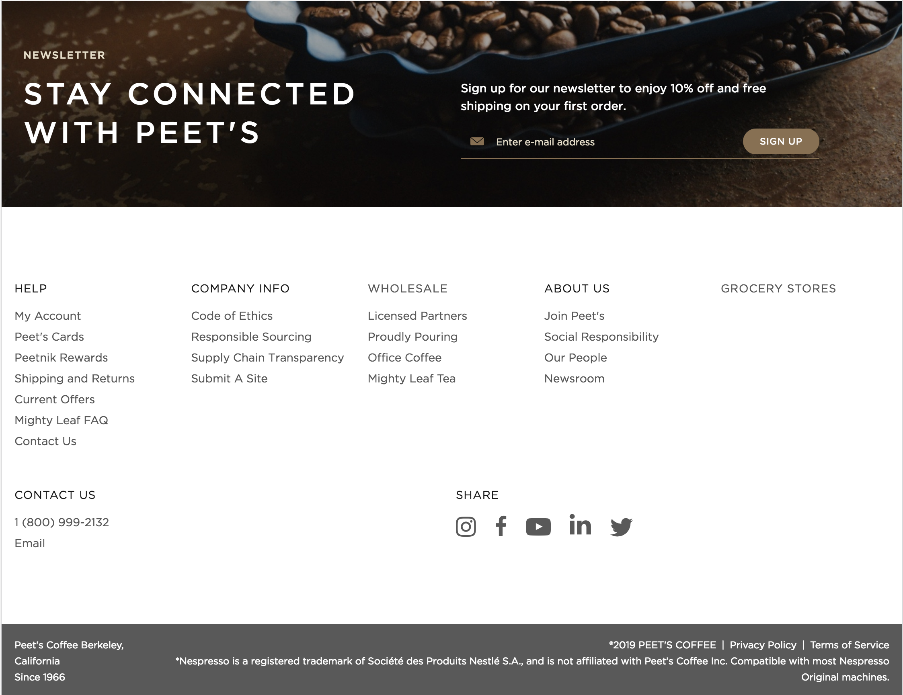
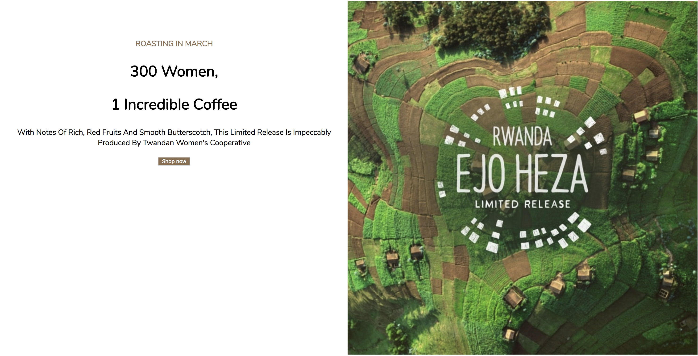
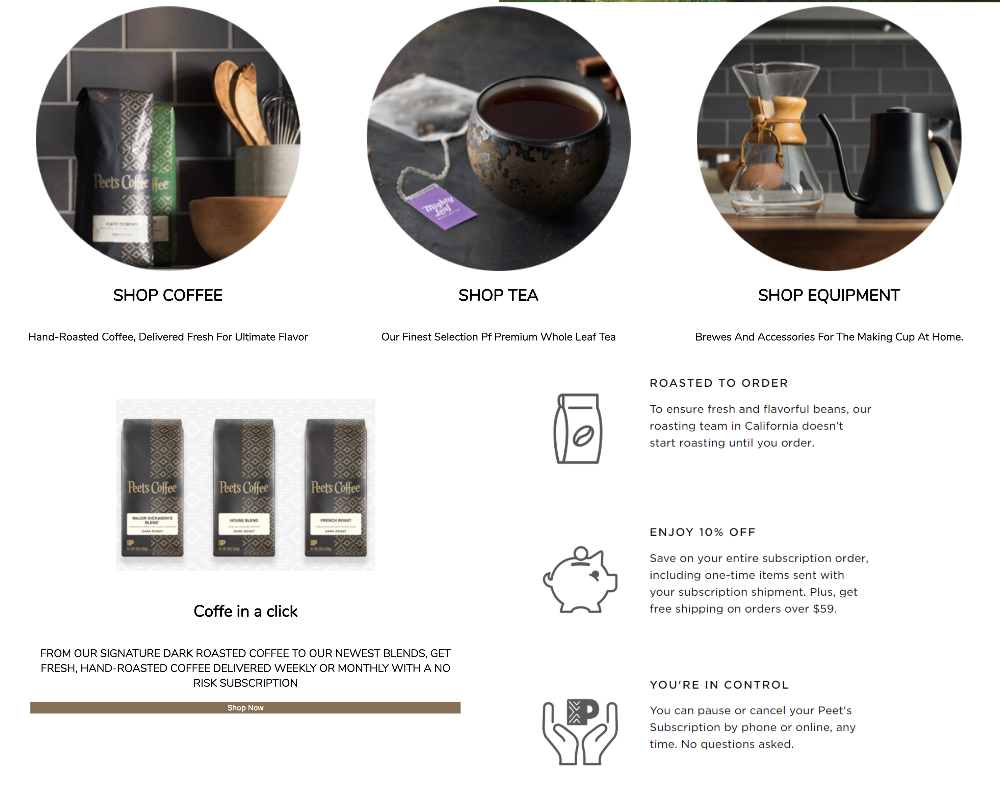
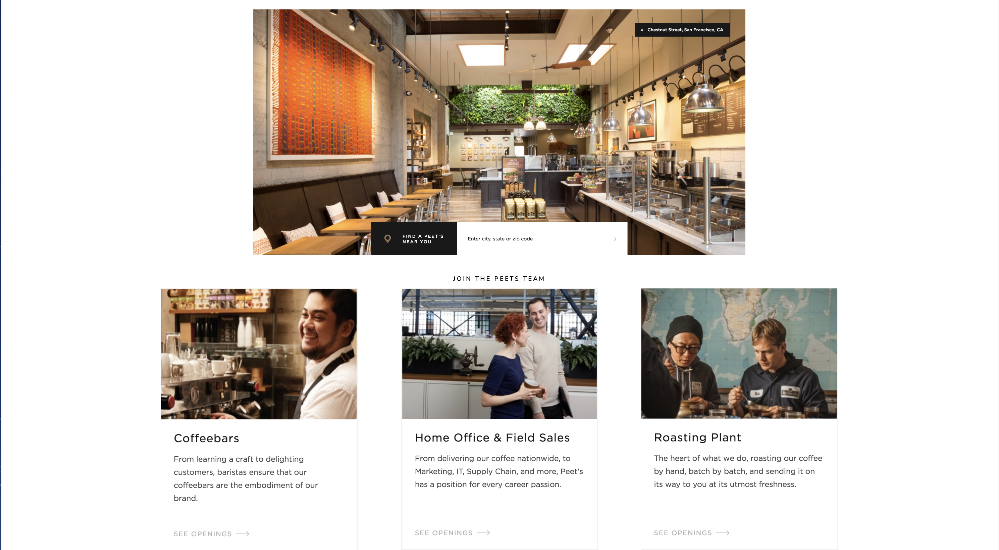
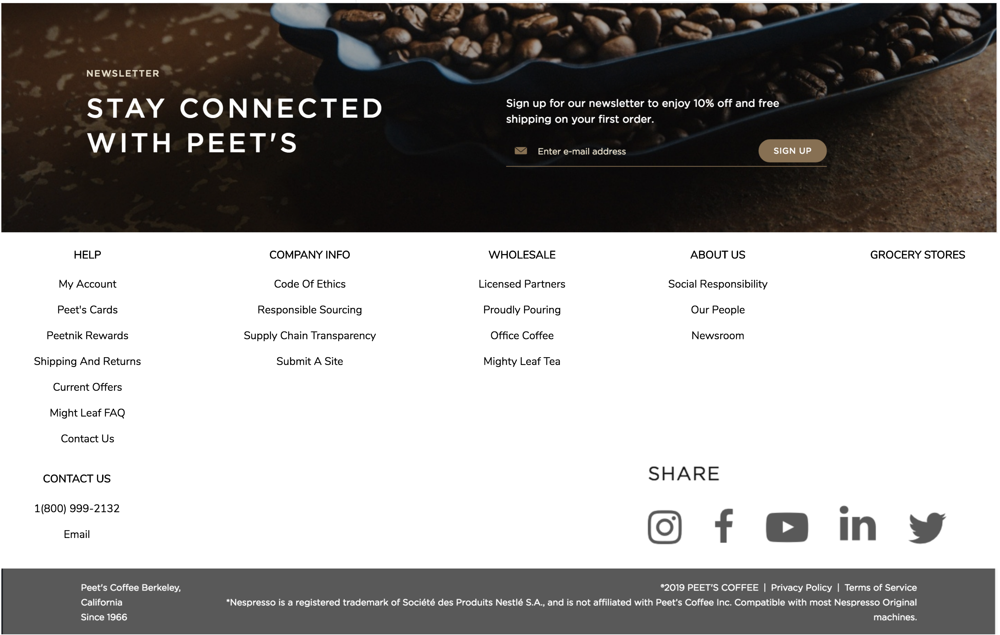

# Victoria Martinez

#### Building Layouts & Preprocessors March 8, 2019

#### By Victoria Martinez

## Objectives
Replicate the landing page of a website
## Learning Objectives
* CSS rules are created and organized using "outside in" best practices.
* Project exhibits understanding of box model best practices.
* Flexbox is used to efficiently present groupings of similar or related elements.
* Media queries are used to change rules based on screen size.
* Styles are written in Sass and well-refactored using Sass functionality.
## Original Website

## Cloned Website

## Setup/Installation Requirements

* Clone from  https://github.com/vmartinezlive/peets.git
* Open in browser of your choice
* View at 

## Known Bugs

There are no known bugs.

## Support and contact details

For issues or concerns you may contact me at vmartinez72@live.com.

## Technologies Used

HTML, SASS, SASS with variable, mixins and media query

### License

Copyright (c) 2015 **Victoria Martinez**
